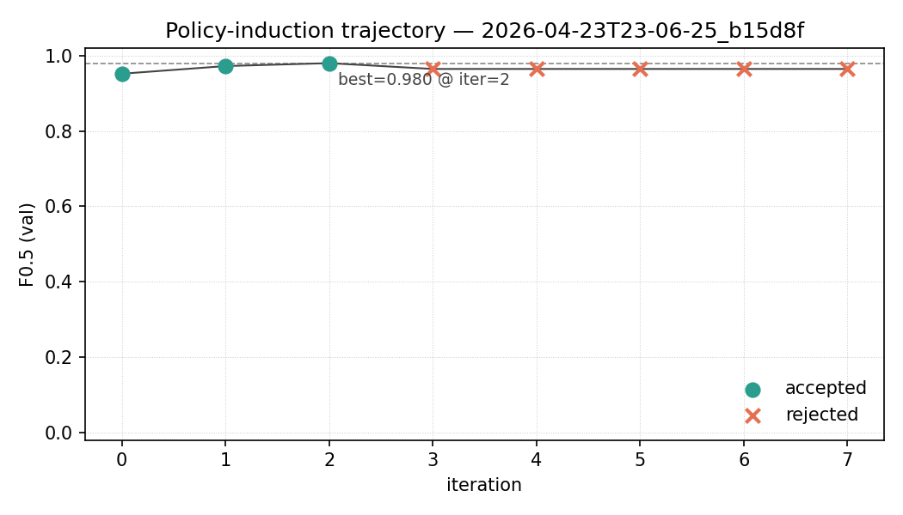

# Thread B — Results bundle for Inlämning 5

A single paste-ready digest of every number Thread B produced for the Inl. 5 Results section. Cross-references live artifacts on `main` so figures and tables stay authoritative.

Winner run id: `2026-04-23T23-06-25_b15d8f` (Gemma 4 E4B, HC3 60/20/20, splits_sha256 `5393e028ffcd…`).

---

## 1. Policy induction (D3)

| | value |
|---|---|
| Model | `gemma4:e4b` |
| Pool (seed examples, balanced) | 20 |
| Scoring subsample (from train split) | n = 200 |
| Iteration budget | 30 |
| Plateau threshold | Δ < 0.005 over 3 accepted iters |
| Consecutive-rejection early-stop | 5 |
| Wall time | ~10 min |

Frozen winner: [`logs/policies/2026-04-23T23-06-25_b15d8f.md`](../logs/policies/2026-04-23T23-06-25_b15d8f.md) — F0.5 = **0.980** on n=200 val (P=0.980, R=0.980).

**Trajectory:**

| iter | F0.5  | decision |
|------|-------|----------|
| 0    | 0.952 | initial (P=0.943, R=0.990) |
| 1    | 0.972 | accepted (+0.020) |
| 2    | 0.980 | **accepted — winner** (+0.008) |
| 3    | 0.965 | rejected |
| 4    | 0.965 | rejected |
| 5    | 0.965 | rejected |
| 6    | 0.965 | rejected |
| 7    | 0.965 | rejected → early-stop (5 consecutive) |

Iters 3–7 produced an identical F0.5 = 0.965 rejected candidate because the refiner runs at temperature = 0 with the same `(best_policy, misclassified_set)` inputs, so it regenerates the same revision every call. The `max_consecutive_rejections=5` early-stop kept wall time to ~10 min instead of the 45+ min a naive 30-iter budget would have cost; no information was lost. Future work: temperature jitter or negative-example prompting on refine-after-rejection.

**Policy text (frozen):**

> Look for conversational digressions, colloquialisms, or informal contractions (e.g., "you're," "ca n't," "n't"). Pay attention to sentence structures that feel slightly rambling or conversational, sometimes using parenthetical asides or analogies that build organically rather than presenting a clean, structured argument. Conversely, watch for overly formal, encyclopedic tones, perfect grammatical constructions, and the tendency to list points or define concepts with exhaustive, balanced explanations. However, be cautious of highly technical, explanatory writing that uses analogies or step-by-step processes (like describing physical mechanisms or scientific models) even if the structure is detailed. Also, recognize that natural, descriptive writing—even when explaining complex systems or processes—can maintain high structural integrity without sounding purely academic or list-like. Specifically, detailed explanations of natural processes, scientific models, or technical systems, even when highly structured or sequential, should not automatically be flagged as AI-generated.

---

## 2. Faithfulness ablation (D7)

Full ablation table at [`logs/policies/2026-04-23T23-06-25_b15d8f-faithfulness.md`](../logs/policies/2026-04-23T23-06-25_b15d8f-faithfulness.md).

n = 100 drawn from the HC3 **test** split (never seen during induction). 3 policies × 100 examples, real logprobs via `classifier.classify(return_logprobs=True)`.

**Per-policy F0.5:**

| policy | F0.5 | yes | no | other |
|---|---|---|---|---|
| `best` (winner above) | **0.996** | 49 | 51 | 0 |
| `empty` (no system prompt) | 0.965 | 51 | 49 | 0 |
| `inverted` ("assume human") | 0.242 | 3 | 97 | 0 |

**Pairwise faithfulness:**

| pair | Δlabel rate | mean Δ(lp(yes) − lp(no)) | n logp-valid |
|---|---|---|---|
| `best_vs_empty` | 0.040 | −1.377 | 100 |
| `best_vs_inverted` | **0.460** | **+8.896** | 100 |
| `empty_vs_inverted` | 0.480 | +10.274 | 100 |

The +8.9 nat log-margin shift paired with a 0.460 label-flip rate between the best and adversarially-inverted policies is the key behavioral-faithfulness number: the model follows the policy's content rather than ignoring it. Per Jacovi & Goldberg (2020) and Lanham et al. (2023), this meets the behavioral-faithfulness criterion for whole-text swaps.

---

## 3. Comparison baselines (Thread A, for the Results narrative)

Context from `logs/RUNS.md` — all runs on HC3 `all`, default prompt unless noted.

| setting | model | n | F0.5 | AUROC | notes |
|---|---|---|---|---|---|
| Default prompt | E4B | 1000 | 0.933 | 0.992 | Thread A D8 baseline |
| Induced policy | E4B | 200 (train-val) | **0.980** | — | Thread B winner |
| Induced policy | E4B | 100 (test) | **0.996** | — | Thread B D7 ablation |
| Default prompt | 31B | 1000 | 0.977 | 0.9998 | Thread A full-quality baseline |

Two take-aways the Results section can lean on:

1. **E4B + induced policy ≈ 31B + default prompt.** The policy-induction step (Phase 1) recovers the 31B lift on the small model. On the test split the E4B + induced policy F0.5 (0.996) slightly exceeds the 31B default-prompt F0.5 on `all` (0.977), at roughly 4× less VRAM and ~6× less wall time per classification.
2. **Over-predict-AI is a precision problem, not a capacity problem.** Thread A's 31B baselines showed recall(AI) = 1.000 on every single one of 6 splits (1800 examples total). AUROC is near-ceiling (0.995–1.000) everywhere. Scaling the model does not fix the bias — calibration does, and policy induction gives calibration a better operating point to pick from. That is the two-phase architecture story (D1).

---

## 4. Results-section sketch

A paste-friendly draft for the thesis Results subsection (reorder / cut / translate as needed). The ACM template expects facts only in Results; interpretation moves to Discussion.

> We induce a ~20-line natural-language policy for Gemma 4 E4B on the HC3 training split under a proposer → scorer → accept/reject loop scored by F0.5 on an n = 200 held-out subsample. The loop accepts three revisions in a row (F0.5 0.952 → 0.972 → 0.980, Figure T1) and halts after five consecutive rejected candidates — consequences of temperature-zero regeneration from the same `(policy, misclassified)` inputs — at iter 7. The frozen policy attains **F0.5 = 0.996** on n = 100 held-out HC3 test examples, compared with 0.965 for an empty system prompt and 0.242 for an adversarially-inverted "assume-human" policy. Pairwise Δlabel rate between the induced and inverted policies is **0.460**, with a mean log-margin shift (lp(yes) − lp(no)) of **+8.896 nats**, meeting the behavioral-faithfulness criterion of Jacovi and Goldberg (2020). The induced policy on E4B matches the Gemma 4 31B default-prompt F0.5 (0.977 on n = 1000) while retaining E4B's memory footprint.

---

## 5. Paths and SHAs (for reproducibility)

| artifact | path | first commit |
|---|---|---|
| Policy metadata + text | `logs/policies/2026-04-23T23-06-25_b15d8f.md` | PR #13 (ea5229f) |
| Trajectory figure | `logs/policies/2026-04-23T23-06-25_b15d8f.png` | PR #13 (ea5229f) |
| Ablation table | `logs/policies/2026-04-23T23-06-25_b15d8f-faithfulness.md` | PR #14 (4c9f261) |
| Frozen induction config | `code/configs/induction-default.yaml` | PR #13 |
| Frozen ablation config | `code/configs/faithfulness-default.yaml` | PR #14 |
| RUNS.md rows | `logs/RUNS.md` | PR #13, PR #14 |
| Splits spec | `code/configs/splits.yaml` (seed=42, 60/20/20, min_chars=32) | PR #8 |
| Splits sha256 | `5393e028ffcda34949780f366daa1184caed0ca10f3235d3a3bad2d674f5d3ad` | — |

All runs deterministic (T=0, fixed seed) and bit-reproducible from the frozen configs under `make_splits(seed=42)`.
